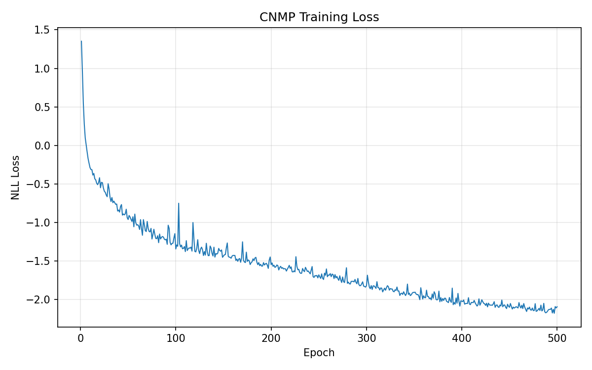
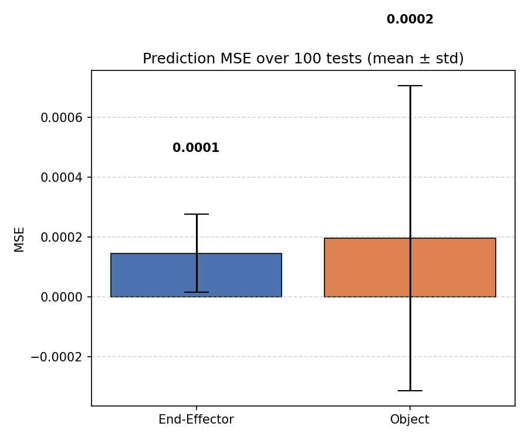

# CMPE 591 — Homework 4: Conditional Neural Movement Primitives

**Learning from Demonstration for Robot Trajectory Prediction**

> This repository is named `CNMP_591_HW_3` because the course skipped HW3; the content targets the **HW4** assignment.

## Problem

Given a dataset of robot demonstration trajectories \{(t, e_y, e_z, o_y, o_z)_i,\; h_i\}_{i=0}^{N}, where e and o denote end effector and object Cartesian coordinates and h is the object height, the goal is to train a Conditional Neural Movement Primitive (CNMP) that predicts future end effector and object positions. The model encodes a variable number of context points via a shared encoder, aggregates them with a mean operator, and the decoder receives the query time t together with the object-height condition h to predict (e_y, e_z, o_y, o_z). At test time, the model generalizes to unseen trajectories and varying numbers of context observations.

## Method

The CNMP architecture consists of a 3-layer encoder MLP that maps each 5-dimensional context point [t, e_y, e_z, o_y, o_z] to a 128 dimensional latent representation. These per point representations are mean-aggregated into a single summary vector r in R^128. A 3-layer decoder MLP then takes the concatenation [t_query, r, h] (130 dimensions) and outputs 8 values: 4 predicted means and 4 predicted log variances for the target dimensions. The model is trained endtoend with a diagonal Gaussian negative log-likelihood (NLL) loss using Adam (lr = 10^-4) for 500 epochs. Log variances are clamped to [-10, 2] for numerical stability.

## Setup

```bash
# Create and activate the environment
conda create -n cmpe591 python=3.9
conda activate cmpe591

# Install dependencies
pip install torch torchvision --index-url https://download.pytorch.org/whl/cu118
pip install mujoco==2.3.2
pip install dm-control==1.0.10
pip install mujoco-python-viewer
pip install numpy matplotlib tqdm scipy
```

## Reproducing Results

All output directories (`data/`, `checkpoints/`, `figures/`) are created automatically.

```bash
# 1. Collect 200 demonstration trajectories (~9 min, headless)
python src/collect_data.py --n 200

# 2. Train the CNMP model for 500 epochs (~10 min on GPU)
python src/train.py --epochs 500

# 3. Evaluate on held-out trajectories (100 tests)
python src/evaluate.py --n-tests 100
```

## Results

| Metric           | Mean     | Std      |
|-------------------|----------|----------|
| End-Effector MSE | 0.000145 | 0.000130 |
| Object MSE       | 0.000195 | 0.000510 |

### Training Loss Curve



### Prediction MSE (Bar Plot)



## Repository Layout

```
CNMP_591_HW_3/
├── src/
│   ├── homework4.py          # Course-provided environment & CNP reference
│   ├── environment.py        # Course-provided MuJoCo base environment
│   ├── mujoco_menagerie/     # Course-provided robot model assets
│   ├── utils.py              # Seeding, device, train/val split, data loading
│   ├── collect_data.py       # Trajectory collection script
│   ├── model.py              # CNMP architecture (Encoder, Decoder, CNMP)
│   ├── train.py              # Training loop with Gaussian NLL loss
│   └── evaluate.py           # Evaluation and MSE bar plot generation
├── data/
│   └── trajectories.pt       # Collected trajectories (generated)
├── checkpoints/
│   ├── cnmp.pt               # Trained model checkpoint (generated)
│   └── loss_history.pt       # Per-epoch loss history (generated)
├── figures/
│   ├── loss_curve.png        # Training loss plot (generated)
│   └── mse_bar.png           # MSE bar plot (generated)
├── README.md
└── .gitignore
```


